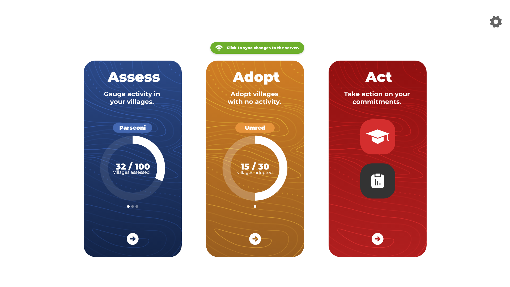

# Companion App

The companion app collects data from local villages and from where there is no internet.

How the companion app collects the data.

- They use a Tablet app for collecting data village by village
- For example, if there is a social issue, what are the languages of people from a particular village?
- There is much more functionality there and I have attached screenshots for better understanding.

## Demo app

The companion app is not built for the public it's used by company employees and they have visited all selected villages and collected a massive number of data from village by village.

## Screenshots

